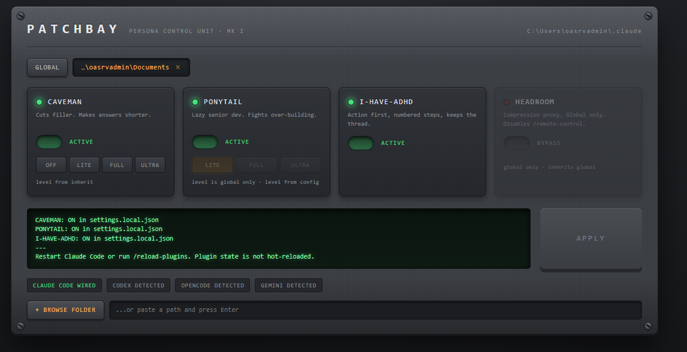
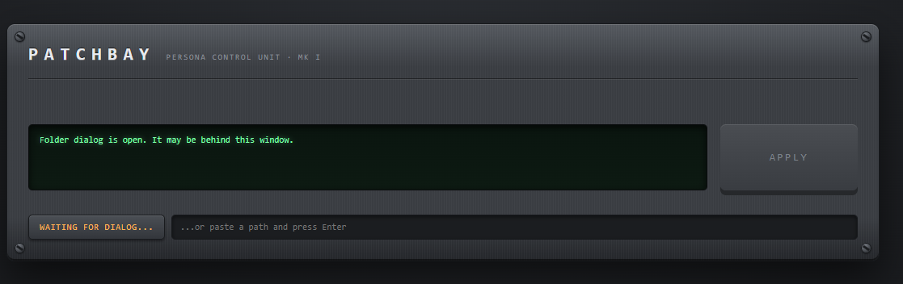

# PATCHBAY

A studio rack for your coding agent's personality.

Four persona plugins (`caveman`, `ponytail`, `i-have-adhd`, `headroom`) each store their
settings in a different file, resolve them in a different order, and disagree about
whether a project folder can override them at all. Working that out by hand means
reading three settings files, two config files and a flag, and knowing which one wins.

Patchbay reads all of it, tells you what is actually in effect, explains why, and writes
the correct file when you hit APPLY.

Zero dependencies. Local only. Node 18+.

```bash
npx github:OthmanAdi/patchbay
```

Opens `http://127.0.0.1:41752`.

APPLY writes the files and the console reports each one.



`+ BROWSE FOLDER` opens the OS folder dialog.



## What it does

**Live.** The panel holds an SSE connection to the server, which watches every config
file involved. Another Claude Code session, the `/plugin` UI or a hand edit shows up
within about a second. A LIVE badge goes red the moment the stream drops, so a stale
panel never looks authoritative.

**Explains itself.** WHY on any module expands the precedence chain: every file
consulted, in order, what each one said, which won, and the effective value. That
answers "why is caveman lite here but full there" with the actual reason.

```
ENABLED, in precedence order
user      true    ~/.claude/settings.json
project   —       <proj>/.claude/settings.json
local     false   <proj>/.claude/settings.local.json
EFFECTIVE false   from local
```

**Shows the diff first.** Pending changes render the before/after of every file that
will be written, before you commit to it, with a REVERT.

**Per folder.** Add any project path and toggle a persona there without touching your
global config. Career folder with caveman off, code repo with it on. DISCOVER offers the
folders Claude Code has actually opened, ranked by whether they already override plugin
settings.

**Careful with your config.** Every write is backed up to `~/.patchbay/backups/<stamp>/`
and lands atomically via temp+rename. An unreadable or malformed settings file aborts the
whole batch rather than being replaced with the two keys patchbay cares about.

## Personas

| Persona | Levels | Scope | What it changes |
|---|---|---|---|
| caveman | off, lite, full, ultra | global + per folder, and its loader walks up from the cwd | Cuts filler. Shorter answers. |
| ponytail | lite, full, ultra | enable per folder, level global only | Lazy senior dev. Fights over-building. Also re-injects ~1.4k tokens into every subagent unless you scope it. |
| i-have-adhd | none | global + per folder | Action first, numbered steps, keeps the thread. Needs the always-on flag as well as the plugin. |
| headroom | none | global only | Compression proxy. Also disables `/remote-control` while routed. |

Those scope differences are not arbitrary, they are what each plugin's own config loader
does. Patchbay greys out what a plugin cannot support rather than pretending.

## Where things live

| | Path |
|---|---|
| Plugin on/off | `~/.claude/settings.json` → `enabledPlugins`, overridden by `<proj>/.claude/settings.json`, then `settings.local.json` |
| caveman level | `%APPDATA%\caveman\config.json`, or `<project>/.caveman/config.json` in any ancestor |
| ponytail level | `%APPDATA%\ponytail\config.json` |
| ponytail subagents | `~/.claude/settings.json` → `env.PONYTAIL_SUBAGENT_MATCHER` |
| adhd always-on | `~/.claude/.i-have-adhd-always` |
| headroom routing | `~/.claude/settings.json` → `env.ANTHROPIC_BASE_URL` |
| tracked folders | `~/.patchbay/folders.json` |

On macOS and Linux the `%APPDATA%` paths become `$XDG_CONFIG_HOME/<name>/config.json` or
`~/.config/<name>/config.json`.

## Two things worth knowing

**Nothing is hot-reloaded.** Plugin enablement is resolved once per session. After APPLY,
run `/reload-plugins` or start a new session.

**Narrower scope wins.** `enabledPlugins` is an ordinary settings key, so
`settings.local.json` in a project overrides your global `settings.json`. Only
`permissions` merges across scopes. That is why a plugin can look enabled globally and
still be dead in one repo.

## Development

```bash
npm test        # node --test, no framework
npm start       # node bin/patchbay.js
```

| Module | Job |
|---|---|
| `src/paths.js` | every location, resolved once |
| `src/jsonio.js` | strict reads, atomic backed-up writes |
| `src/resolve.js` | precedence and the ancestor walk, returning an explainable chain |
| `src/registry.js` | what each persona is and how it resolves |
| `src/state.js` | build the panel's view, pure reads |
| `src/apply.js` | stage every change in one transaction, then write |
| `src/watch.js` | directory watching, debounce, echo suppression, state hash |

## Agent support

Claude Code is wired. Codex, OpenCode and Gemini CLI are detected and shown, but writing
their configs is not implemented, and the panel says so rather than silently doing
nothing.

## Security

The server binds `127.0.0.1` and refuses non-loopback requests. It writes to your agent
config, so do not expose the port.

MIT.
